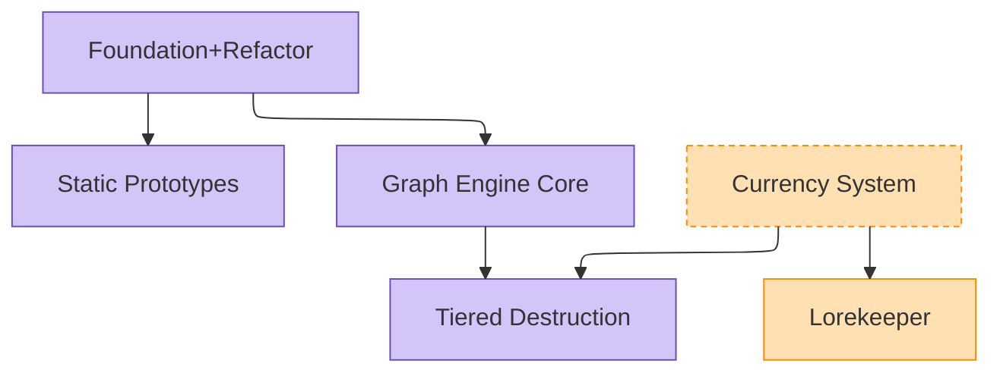

# Brainstorming — Shared Procedures

> Shared procedure surface for the [`idea_brainstorm`](../idea_brainstorm/SKILL.md) and [`architecture_brainstorm`](../architecture_brainstorm/SKILL.md) skills. Both skills reference this file via *"[Shared] See `_brainstorm_shared/common.md` §X."*
>
> This file is NOT a skill — no frontmatter, not directly invocable. It documents shared procedure that both brainstorming skills depend on.

---

## §1. Existing-doc check (FIRST step in both skills)

**Rule:** Before any other procedure step, verify a brainstorm doc doesn't already exist for this topic. Three asks, each routed to the surface that actually holds the answer — the vault digest CANNOT answer the memory or code questions (those stores aren't in its paths), and `read_files` fails silently on directory paths (`feedback_read_files_enumerate_first.md`).

1. **Existing-doc digest — ONE `mcp__ai-worker__read_files` call over enumerated files.** Glob the vault brainstorm surfaces to concrete `.md` paths first, then bundle:

   ```
   Glob over: DevProjects/{{PROJECT_NAME}}/Claude/{Design,Planning,BrainstormingDesigns,Documentation}/**/*.md
              + DevProjects/Jmodot/Claude/**/*.md
   mcp__ai-worker__read_files(
     paths=[<concrete .md paths from the glob — prune to plausibly-topic-adjacent
            folders when the listing is large>],
     question="Does an existing brainstorm / design doc cover <topic>?
               If yes, give the path, a 1-line summary, and the
               `status:` frontmatter value."
   )
   ```

   The worker reads files in its own process — Claude pays a 1-2 KB digest instead of 50+ KB of search-result spew. Do not chain `obsidian_global_search` / `mcp__plugin_semantic-search_semantic-search__search` / `obsidian_read_note` / `Read` to assemble this; chaining is the canonical anti-pattern this discipline exists to prevent (per CLAUDE.md §9 + the always-loaded routing summary). The cascade anti-pattern (running searches first, then routing overflow to `read_files`) defeats it equally: searches already burned context tokens before any synthesis happened.

2. **Memory gotcha sweep — semantic-search, NOT the worker.** Memory lives in `.claude/auto-memory/`, which the vault digest can't see. Run `mcp__plugin_semantic-search_semantic-search__search(query="<topic NL paraphrase>", restrictToDir=".claude/auto-memory")` per CLAUDE.md §2 — repo-relative posix path; search facets separately for broad topics.

3. **Abstraction inventory — semantic-search → LSP, NOT the worker.** Existing 2+ subclass families live in code, not vault docs. At §1 time one semantic-search over the topic's domain types is enough to spot an obvious family early; `/architecture_brainstorm` Step 3 owns the full inventory procedure. `/idea_brainstorm` may skip this ask (ideas precede architecture).

4. **Skim recent commits** (`git log --oneline -10`) for related work in flight — Bash one-liner; not a synthesis call, so does not trigger the chaining concern in step 1.

5. **If the digest names a relevant existing doc:** redirect the user — *"`<path>` (status: `<status>`) covers this. Want me to read it and resume from there?"* — and STOP. Brainstorming from scratch would duplicate effort.

### §1.1 If user accepts "resume from there"

Resume procedure depends on the doc's `status:` frontmatter:

| Status | Resume action |
|---|---|
| `ideation-active` | Resume mid-procedure in `/idea_brainstorm`. Read the doc's existing cluster surveys; pick up at the next cluster or at user-flagged open questions. |
| `ideation-complete` | Idea bank is settled. User probably wants to convert ideas into architecture — hand off to `/architecture_brainstorm`. |
| `active-brainstorming` | Resume mid-procedure in `/architecture_brainstorm`. Re-read any open Parts on roadmap.md with `*-pending` / `*-rework` state; treat their Triggers as Socratic seeds. Don't restart from scratch. |
| `brainstorming-complete` | Doc is approved; check the topic-folder `roadmap.md` for Parts. If `plan-pending` Parts exist, user likely asking for IMPLEMENTATION — redirect to Plan Mode or the relevant authoring skill. If all Parts are `*-pending` / `*-rework`, the next session is the corresponding brainstorm phase per State (`arch-pending` → `/architecture_brainstorm`; `idea-pending` / `idea-rework` → `/idea_brainstorm`). If the roadmap predates the current skill state, route via §1.2 (stale-roadmap remediation) instead. |

**Status match strips any `-vN.M` revision suffix.** A doc with `status: brainstorming-complete-v1.2` matches the `brainstorming-complete` row. The suffix records authoring iteration (per §5 *Revising a saved doc*), not a separate lifecycle state.

Doc-revision discipline still applies (in-place rewrite, not v1.1 footers — see each skill's save step).

### §1.2 Stale-roadmap remediation

A `brainstorming-complete` doc whose `roadmap.md` predates the current skill state — e.g., `plan-pending` Parts with empty / boilerplate Trigger, `last_revised` older than the calling SKILL's last-modified date, or Part names following an older naming convention — is not safe to resume from directly. Re-run `architecture_brainstorm` Step 5 against the existing design body before any new Parts land.

**Procedure:**

1. Read the existing design doc (treat as approved input — Steps 1–4 of the arch SKILL are skipped).
2. Apply the full Step 5 sequence to the design body: PR-grouping guard → arch-pending consolidation litmus → user-owned question → 5-criterion readiness gate → plan-pending cohesion litmus → downstream-of-fork guard → Trigger format per §6.10 → Integration touch points.
3. Hand the resulting fresh Part list to `/update_roadmap` (it replaces the stale Parts table in a single batch diff).

**Why this exists:** Parts authored under an older sizing axis (pre-consolidation-litmus, pre-downstream-of-fork guard, etc.) inherit the wrong shape silently. Re-importing them into the current skill state without re-gating bakes the prior axis into the new roadmap.

**Forbidden in §1:**

- ❌ `obsidian_global_search("<topic>")` followed by `obsidian_read_note(path)` chains
- ❌ Multiple `mcp__plugin_semantic-search_semantic-search__search` calls across keyword variants
- ❌ `Read(path)` on Obsidian docs to "see what's there before bundling" (synthesis-shaped path; routes through `read_files`)
- ❌ The "I'll bundle through `read_files` after these searches" pattern — too late, the searches already paid context
- ❌ `read_files(paths=["<directory>/"])` — directory paths return nothing, silently; enumerate concrete files first (`feedback_read_files_enumerate_first.md`)
- ❌ Asking the worker for Memory gotchas or code-abstraction inventory — those stores aren't in the vault paths it reads; route per steps 2–3 above

---

## §2. Rationale spot-check (one-shot)

After `write_doc` returns the structure digest, do ONE bounded `Read(file_path=..., offset=N, limit=M)` covering the architecturally load-bearing sections — typically the Approach Selected paragraphs, the Recommended-starting Part rationale (architecture skill only), and any leading-hypothesis flags. Verify:

- [ ] Each rejected approach names a SPECIFIC reason for rejection (not "less suitable" / "didn't fit").
- [ ] Each architectural commitment cites a concrete invariant, file path, or class name.
- [ ] No conversational provenance markers ("user surfaced", "per user direction") appear inline — those belong in Revision History.
- [ ] Idea pools are sampled (target count + 5–10 entries), not exhaustively enumerated.

If any check fails, refine the spec with explicit Must-include facts addressing the gap and re-run `write_doc`. Do NOT edit the doc directly — keep the worker as single author for voice consistency.

**Why this step exists:** pure structure-digest verification (per the global Documentation Delegation Rule) cannot detect rationale-density drift — compressed worker output passes structural checks while losing rejected-approach rationale. This spot-check is defense-in-depth against silent compression by any current or future writer model. Cost: ~5–10k context tokens, one-shot per doc, regardless of revision count.

---

## §3. MCP-Offline Policy

**Obsidian MCP offline → non-event.** Brainstorm-doc reads (`Read`) and saves (`Write`/`Edit`) hit the vault filesystem directly. No connectivity check, no abort gate. Full convention: CLAUDE.md §3 / `obsidian_conventions` skill.

**ai-worker MCP offline → fallback to a Haiku subagent.** When `mcp__ai-worker__read_files` / `mcp__ai-worker__read_web` are unavailable (deferred-tool list omits them, or `ToolSearch` returns no match), substitute a Haiku subagent for the same bundled-synthesis role — do NOT degrade to chained native `Read` / `WebFetch`:

```
Agent(
  subagent_type="general-purpose",
  model="haiku",
  description="Bundled doc digest",
  prompt="Read these paths and answer <question>:
           - <path1>
           - <path2>
           - <path3>
         Report in under 300 words: <specific asks>."
)
```

The subagent reads the paths in its own context — parent Claude pays the digest tokens, not the raw file tokens — preserving the same context-efficiency contract as `read_files`. Same shape for the `read_web` substitution (pass URLs + question). The synthesis-shape routing rule (CLAUDE.md §9) still applies; the substitution is at the *executor* layer, not the *should-I-bundle* layer. Applies anywhere a brainstorm step calls for `read_files` (§1 existing-doc check, §2 rationale spot-check fallback when the read is multi-section, final `write_doc` synthesis cases).

---

## §4. User review gate

After the calling skill's spec-review loop passes, ask the user to review the written spec before proceeding:

> "Spec written and committed to `<path>`. Please review it and let me know if you want to make any changes before we [continue / hand off to the next skill]."

Wait for the user's response. If they request changes, make them and re-run the spec review loop. Only proceed once the user approves.

---

## §5. Doc-path & frontmatter conventions (generic — both skills)

**Path tiebreaker** (per CLAUDE.md §3 *Obsidian (The Design Source)*):

> *"if a doc would be useful in another game built on Jmodot, it goes under `Jmodot/Claude/`."*

| Topic shape | Destination |
|---|---|
| PP-game-specific (spell mechanics, gameplay design, content) | `DevProjects/{{PROJECT_NAME}}/Claude/BrainstormingDesigns/YYYY-MM-DD-<topic>/` |
| Jmodot-framework-general (AI architecture, framework design, cross-game patterns) | `DevProjects/Jmodot/Claude/BrainstormingDesigns/YYYY-MM-DD-<topic>/` |

**Folder-per-topic convention (always-folder default):** Every brainstorm topic is a folder. Folder name: `YYYY-MM-DD-<kebab-case-topic>/` (date = topic inception). Promoting a flat file later costs more than starting with a folder.

**Files inside a topic folder:**

| Filename | Produced by | When |
|---|---|---|
| `ideas.md` | `/idea_brainstorm` | Topic started with ideation phase |
| `arch-<cluster-slug>.md` | `/architecture_brainstorm` | One per cluster from upstream `ideas.md` (per Per-Cluster Routing) |
| `arch.md` | `/architecture_brainstorm` | Direct-arch invocation (no upstream ideation — mature domain or user-direct framing) |
| `arch-<cluster-slug>-followup-N.md` | `/architecture_brainstorm` | Follow-up arch session ripened from an earlier `arch-pending` Part |
| `arch-<hybrid-slug>.md` | `/architecture_brainstorm` | Cross-cluster hybrid from `ideas.md` Cross-Pollination section ripening |

**Frontmatter template (per skill — minor variations):**

```yaml
---
created: YYYY-MM-DD
author: Claude [Model]
status: <skill-specific status>
topic: <one-line description>
scope: pp-game | jmodot-framework
phase: idea_brainstorm | architecture_brainstorm
derived_from: ../ideas.md               # arch docs only — points to upstream ideas.md or external source
cluster: <cluster-slug>                 # arch-<cluster>.md only — names the upstream cluster
---
```

Status taxonomy per skill:
- `idea_brainstorm`: `ideation-active` → `ideation-complete`
- `architecture_brainstorm`: `active-brainstorming` → `brainstorming-complete`

Doc status is binary by design — `complete` doesn't imply *every* Part is `plan-pending`. Per-Part fork state (`arch-pending` / `idea-pending` mixed with `plan-pending`) lives in `roadmap.md`'s State column (§6.3); duplicating it as a status suffix here would create drift across two surfaces.

**Revising a saved doc:** When feedback invalidates a saved section, rewrite in-place in the main body — don't append a "v1.1" footer that leaves the wrong recommendation at the top. Reasoning trail goes in a Revision History footer at the END; bump `status: <phase>-complete-vN.M`. **Tool choice:** prefer `Edit` for 1-3 section corrections (context-efficient); reserve `Write` / Obsidian-overwrite for structural rewrites (6+ sections). See `feedback_doc_revision_in_place.md`.

**Status / revision-history sync:** Bump `status:` frontmatter and Revision History footer in the SAME edit. Frontmatter is source of truth; footer mirrors.

### §5.1 Spawn-placement convention (when a brainstorm spawns a child)

When this brainstorm spawns a follow-up — sub-brainstorm, arch revisit, sibling concern — three placement outcomes. Choose at Step 1 of the calling skill (existing-doc check identifies the placement question; this rule resolves it).

| Outcome | Placement | Roadmap consequence |
|---|---|---|
| **Sub-component** of parent topic (audience = parent only) | Same folder, sibling file (`arch-<slug>.md`, `arch-<slug>-followup-N.md`) | Same `roadmap.md`; new Part(s) added |
| **Deeper scope** within parent (own internal sequence; audience confined) | Child subfolder `<parent>/<sub-slug>/` holding BOTH the design doc (`arch.md` / `ideas.md`) AND its own `roadmap.md`. **The design doc saves INTO the subfolder — never the parent topic folder** (recurring mis-save). The brainstorm Step 6/5 saves the design doc into `<parent>/<sub-slug>/`; the matching child `roadmap.md` follows via `/update_roadmap` (see ownership note below). | Parent's decomposed Part transitions to `submap-pending` (§6.3); cross-references via `Spawned sub-brainstorms` section |
| **Cross-cutting concern** (audience = 2+ unrelated parent topics) | Sibling folder at same depth (`YYYY-MM-DD-<sibling-slug>/`) with own `roadmap.md` | Parent roadmap references via cross-folder path |

**Three-criterion test — outcome chosen by WHICH criteria hold (not "all three"):**

The three criteria together discriminate between the three outcomes above; each outcome consumes a different subset. Criterion 3 is the **submap-vs-sibling distinguisher**, NOT a gate the submap outcome must pass.

1. **Brainstorm-shaped scope** — the sub-topic warrants its own focused brainstorm session (≥1 hour Socratic, multi-cluster, OR multi-approach), not just an extension paragraph in the parent.
2. **Plausibly independent maturity progression** — the sub-topic's Parts CAN mature on a different timeline than the parent. Doesn't need to actually diverge; just must be able to.
3. **Reusable artifact** — the resulting design doc(s) are likely to be referenced by sources beyond the immediate parent brainstorm.

| Outcome | Criterion 1 (brainstorm-shaped) | Criterion 2 (independent maturity) | Criterion 3 (reusable beyond parent) |
|---|---|---|---|
| **Sub-component** (same-folder sibling, no new roadmap) | ✗ (just an extension) OR — | — | — |
| **Deeper scope** (child subfolder + own roadmap → submap-pending) | ✓ | ✓ | **✗** (audience confined to parent — see table row above) |
| **Cross-cutting concern** (sibling folder + own roadmap) | ✓ | ✓ | ✓ |

**Read the table left-to-right:** Criterion 1 fails (or the topic doesn't need its own session) → outcome 1 (same-folder, no new roadmap). Criteria 1+2 pass but 3 fails (parent-confined audience) → outcome 2 (submap). All three pass → outcome 3 (sibling folder).

**Common gotchas:**
- ❌ **Failing the submap outcome against criterion 3.** A submap's defining property is parent-confined audience — criterion 3 is *expected* to fail. Citing "only serves the parent" as a submap rejection is misapplying the sibling-folder gate.
- ❌ **Over-spawning subfolders for sub-component forks** that fail criterion 1 (just an extension paragraph). Those belong as same-folder siblings.
- ❌ **Promoting a submap to sibling-folder because the design doc feels reusable.** Reusability requires concrete *anticipated consumers* outside the parent topic, not just doc generality.

**Important — child roadmap.md ownership:** for *deeper-scope* outcomes, the child subfolder's `roadmap.md` is CREATED by `/update_roadmap` (invoked from architecture_brainstorm SKILL Step 8 as the second of two invocations — see SKILL Step 8 multi-roadmap case). It is NOT created by the brainstorm SKILL's design-doc save step (Step 6 saves the design doc *only* — see `architecture_brainstorm/SKILL.md` Step 6 *Roadmap.md is NOT saved here* guardrail; symmetric `idea_brainstorm/SKILL.md` Step 5 guardrail). Inline-authoring child roadmaps via `write_doc` / `write_code` / direct `Write` bypasses Trigger validators (§6.10), derived-view recomputation (§6.5), Mermaid deterministic regen (§6.4), and the revision-log discipline (§6.7). The single-executor pattern applies recursively: every roadmap.md at every depth routes through `/update_roadmap`.

---

## §6. Roadmap.md schema

Every brainstorm topic folder owns one `roadmap.md` — the routing layer above its design docs (`ideas.md`, `arch.md`, `arch-*.md`). The roadmap is **the live source of truth for sequence, state, and dependency between Parts**; design docs remain the source of truth for their content.

Maintained by [`/update_roadmap`](../../commands/update_roadmap.md), invoked as the final step of both `/idea_brainstorm` and `/architecture_brainstorm`, plus standalone for Part transitions.

### §6.1 Frontmatter

```yaml
---
created: YYYY-MM-DD
topic: <one-line>
scope-level: subsystem | whole-game | feature      # informs Part-granularity
parent-roadmap: ../<parent>/roadmap.md             # optional, only if nested
status: active | complete | archived
last_revised: YYYY-MM-DD
---
```

**`scope-level` vocabulary** — picks the right Part-granularity for the topic:

| Value | Meaning | Parts are sized as… |
|---|---|---|
| `subsystem` | A single named subsystem (per `project_subsystems` registry) — e.g., the Currency System, the Combat Reaction system | Impl-unit Parts (one `plan-pending` Part ≈ one Plan Mode session) |
| `feature` | A narrower scope inside a subsystem — e.g., a single new HSM transition family, one spell archetype | Impl-unit Parts; usually 1–5 total |
| `whole-game` | Spans 2+ subsystems — meta-progression rework, cross-system retheme | Subsystem-shaped Parts per §6.9 (each row links a child roadmap) |

### §6.2 Parts table

Sequence-ordered, with un-sequenced Parts below a divider rule. Parallel-safe Parts share the same `Pos` value (rendered at the same depth in the Mermaid diagram).

```markdown
## Parts

| Pos | Part | State | Deps | Trigger | Source |
|---|---|---|---|---|---|
| 1 | Foundation+Refactor | plan-pending | — | — | [[arch#Session 1 — Foundation+Refactor\|arch.md §S1]] |
| 2 | Static Prototypes | plan-pending | Foundation+Refactor | — | [[arch#Session 2 — Static Prototypes\|arch.md §S2]] |
| 2 | Graph Engine Core | plan-pending | Foundation+Refactor | — | [[arch#Session 3 — Graph Engine Core\|arch.md §S3]] |
| 3 | Tiered Destruction | plan-pending | Graph Engine Core, Currency System | — | [[arch#Session 4b — Tiered Destruction\|arch.md §S4b]] |
|   | ─── unsequenced ─── |   |   |   |   |
| — | Currency System | idea-rework | — | next idea session | [[2026-05-12-roguelike-replayability-ideas/ideas#Cluster 1 — Meta Currency / Economy\|ideas.md §c1]] |
| — | Lorekeeper | arch-pending | Currency System | when Currency advances | [[2026-05-12-roguelike-replayability-ideas/ideas#Cluster 3 — Almanack Reward Economy\|ideas.md §c3]] |
| — | Hidden 6th Floor | idea-pending | — | post-MVP playtest | [[2026-05-12-roguelike-replayability-ideas/ideas#Hidden 6th Floor / True Ending\|ideas.md §future]] |
```

**Columns:**
- **Pos** — sequence position. Integer for sequenced; `—` for un-sequenced. Two+ rows sharing the same `Pos` are parallel-safe at that stage.
- **Part** — the stable identifier. Used in Deps cells. Renaming triggers a global rewrite via `/update_roadmap`.
- **State** — one of 9 values (§6.3).
- **Deps** — comma-separated Part names this Part blocks on. Cross-folder deps: `(parent) <Part Name>` (short canonical form — integrates with the Mermaid `external` classDef per §6.4) OR `[[../<folder>/roadmap\|<folder>]] § "<Part Name>"` (file wikilink + prose Part name, when a clickable link adds value). **Do NOT use `../<folder>/roadmap.md#<part-name>`** — Parts live in table rows, not headings, so the `#` anchor always falls through to file-top. The `(parent) <Part Name>` shape is the source of truth for cross-folder Part identity; `/update_roadmap rename` rewrites this string vault-wide.
- **Trigger** — short ripening criterion for un-sequenced or low-maturity Parts (`—` if not applicable). Long triggers footnote into a *Trigger detail* subsection.
- **Source** — Obsidian wikilink to the originating design-doc heading: `[[<doc>#<verbatim heading>\|<short display>]]`. Anchor text = **literal heading text** (not GitHub-style kebab-case slugs); preserve `Section ` prefixes and ` — ` em-dashes verbatim; escape the alias pipe as `\|` inside the table cell. **Default: single most-relevant section anchor.** Even when the Part touches 2-3 adjacent sub-sections (e.g., §3.2-3.4), pick the most architecturally-load-bearing anchor — typically the one naming the Part's primary type, contract, or lifecycle. **Multi-anchor (`+`-separated) ONLY when the Part's commitment legitimately spans 2+ NON-ADJACENT design-doc sections** — never fabricate a joined anchor (`#1.4 X and Y`) that doesn't exist as a real heading; Obsidian falls through silently to file-top, masking the breakage. Cross-roadmap *Part* references (rather than design-doc *section* references) follow the Deps cross-folder shape above (Parts aren't headings). Full anchor-link rules + common verbatim pitfalls: the `obsidian_conventions` skill → *Wikilinks & Heading Anchors*. `/update_roadmap` Step 3 validates anchor coherence at create/update time.

### §6.3 State vocabulary

Single field, 10 values. Phase-position is encoded in the prefix; sub-state in the suffix.

| State | Meaning | Next-phase action |
|---|---|---|
| `idea-pending` | Awaits idea brainstorm | `/idea_brainstorm` |
| `idea-rework` | Was further along, idea phase needs redo | `/idea_brainstorm` revisit |
| `arch-pending` | Has idea, awaits arch brainstorm | `/architecture_brainstorm` |
| `arch-rework` | Was further along, arch phase needs redo | `/architecture_brainstorm` revisit |
| `plan-pending` | Has arch, ready for Plan Mode + impl | Plan Mode |
| `submap-pending` | Decomposition delegated to a sub-roadmap (this Part on parent ≡ N Parts on child) | sub-roadmap progresses → auto-promotes to `complete` when all child Parts complete |
| `workshop-pending` | Awaits user decision (no agent action possible) | user, then re-route |
| `user-owned` | Execution is user-domain (spatial design, manual content authoring, taste-driven tuning); no agent phase applies. Roadmap-resident — carries deps and dependents. | user builds → `complete` |
| `complete` | Shipped | none (terminal) |
| `abandoned` | Dropped | none (terminal) |

`user-owned` requires a Trigger naming the user deliverable. Transitions only to `complete` / `abandoned`. Distinct from `workshop-pending` (transient decision gate that re-routes to an agent phase) and from `User-Tasks.md` worklog routing (standalone items without roadmap deps).

`submap-pending` is used when a Part's scope warrants its own brainstorm-folder + roadmap (per §5.1 *deeper scope* outcome). The parent Part stays in place — preserves Deps, Source, and dependent edges — while execution moves to the child sub-roadmap. Cross-folder Deps from sibling Parts still target the parent Part name; `submap-pending` is invisible to them until the parent auto-promotes to `complete`. Derived views (§6.5) exclude `submap-pending` Parts from both *Currently ready* and *Blocked* — the sub-roadmap owns those views for its own Parts. Distinct from `arch-pending`: `arch-pending` means *"never had arch brainstorm"*; `submap-pending` means *"arch DID run and produced a decomposition that lives at the linked path"*. Conflating the two erases the "came back" history that the Mermaid dashed-stroke discipline (and the Trigger field) is built to preserve.

**"Blocked" is computed, not stored.** A Part with State `*-pending` whose Deps aren't all `complete` is *effectively* blocked — rendered in the derived *Blocked* view, not stored. External (non-dep) blockers live in the Trigger column.

**No "active" states.** A Part being worked on during a session is session-internal. The roadmap records the persistent landmark (state at session end), not the working-state during.

**`plan-rework` is intentionally absent.** If Plan Mode discovers arch gaps, the Part kicks back to `arch-rework` — one phase back. That's the honest move.

### §6.4 Embedded Mermaid diagram

`roadmap.md` includes a Mermaid block beneath the Parts table, wrapped by a `## Current state — Mermaid` heading (this heading is the structural anchor `/update_roadmap` Step 4 uses to locate-and-replace the block; do not rename). **Regenerated deterministically by `/update_roadmap` on every update — never hand-edited.** Palette and styling discipline follow the `mermaid_diagrams` skill (canonical roles → roadmap class names).



Color encodes phase; dashed stroke encodes rework / abandoned / submap-pending / external. Dasharray + fill together distinguish the four dashed classes: `rework` `4 3` (tight dash, orange fill), `abandoned` `4 3` (same dash, grey fill), `submap` `8 4` (long dash, teal), `external` `6 4` (medium dash, grey — for parent-roadmap nodes referenced from sub-roadmaps per §6.12). The `external` class is used only on sub-roadmaps; combine with `-.->` (Mermaid dashed-arrow syntax) for cross-roadmap edges. The `layout: elk` frontmatter is standard for roadmaps — they grow branchy, and ELK reduces edge crossings (see the `mermaid_diagrams` skill).

**Node label rule:** Part name **verbatim, NO `Pos N. ` prefix.** Mermaid's CommonMark parser interprets leading `N. ` as an ordered-list item and emits "Unsupported markdown: list" warnings (one per offending node). Pos is encoded by graph rank, not by label-prefix. If the renderer must show Pos in-label (e.g. when ranks aren't visually obvious), use `N: Name` / `[N] Name` / `Pos N — Name`. Same constraint applies to leading `- ` / `* ` / `# ` / `> `. Full renderer-constraint set: [`mermaid_diagrams` skill](../mermaid_diagrams/SKILL.md) → *Renderer constraints*.

### §6.5 Derived views

Three sections rendered below the Mermaid by `/update_roadmap`. Each heading below is required verbatim — they are the structural anchors `/update_roadmap` Step 5 uses to locate-and-replace each derived block; do not rename.

```markdown
## Currently ready to execute
Parts where State ∈ {idea-pending, arch-pending, plan-pending, idea-rework, arch-rework} AND every Dep has State=complete.
- Foundation+Refactor — Plan Mode (Pos 1, no deps)

## Blocked / awaiting deps
Parts where State ∈ {idea-pending, arch-pending, plan-pending, idea-rework, arch-rework} blocked by incomplete deps.
- Tiered Destruction — waiting on Graph Engine Core (plan-pending), Currency System (idea-rework)
- Lorekeeper — waiting on Currency System (idea-rework)

## Ready for you (user-owned)
Parts where State=user-owned AND every Dep has State=complete. Trigger names the user deliverable.
- Static Prototype Floors — design 10–15 static map scenes (Pos 2, no deps)
```

`submap-pending` Parts are excluded from all three derived views by design — the sub-roadmap owns the *Currently ready* / *Blocked* views for its own Parts. The parent's submap-pending Part appears only in the *Spawned sub-brainstorms* section (§6.6) pointing to the child roadmap, plus as an un-completed Dep of any sibling Part that depends on it (which then surfaces in *Blocked* — the standard mechanism).

### §6.6 Spawned sub-brainstorms

Cross-references to child docs that feed back to this roadmap or spawned their own.

```markdown
## Spawned sub-brainstorms
- `arch-body-tissue-affinity.md` — spawned from Part "Tiered Destruction" on 2026-05-15. Same folder (sub-component; §5.1 criterion 3 fails). Status: brainstorming-complete.
- `../meta-progression/roadmap.md` — sibling folder spawned 2026-05-20 (cross-cutting; all 3 §5.1 criteria met).
```

A child sub-roadmap's entry names at most the bare child Part count — **never a per-state breakdown** (`N complete, M arch-pending`). Same denormalization-drift rule as §6.10: child state is child-owned.

### §6.7 Revision log

Append-only. One line per state transition. Date-stamped.

```markdown
## Revision Log
- 2026-05-13 — Initial roadmap from `arch.md`. 7 Parts in sequence (Pos 1-7), 12 un-sequenced.
- 2026-05-15 — Tiered Destruction's body-tissue dep spawned `arch-body-tissue-affinity.md` (same folder).
- 2026-05-20 — Currency System: idea-pending → idea-rework (insufficient diversity surfaced in arch attempt).
```

### §6.8 Cross-folder dep resolution

Deps can cross folders. **Canonical shape:** `Deps: (parent) <Part Name>` — short form, default, integrates with the Mermaid `external` classDef per §6.4. When the dep targets a sibling-folder roadmap (not a parent), substitute the folder slug for `parent` (e.g., `(currency) Tide Stub`). When a clickable file link adds value (typically Source cells, not Deps), use `[[../<folder>/roadmap\|<folder>]] § "<Part Name>"` — file wikilink + prose Part name.

**Forbidden:** `../<folder>/roadmap.md#<part-name>` and `[[../<folder>/roadmap#<part-name>]]`. Parts live in table rows, not `##`/`###` headings, so any `#<part>` anchor falls through silently to file-top — the canonical silent-failure mode this section's shape rules exist to prevent.

Resolution is **lazy** — `/update_roadmap` reads referenced roadmaps only when generating the *Currently-Ready* view, not on every update. Stale cross-folder state is acceptable; eager mirroring would introduce consistency bugs. The `(parent) <Part Name>` shape is also the string `/update_roadmap rename <old> <new>` rewrites vault-wide, so cross-folder identity stays in sync with renames at the source.

### §6.9 Hierarchical roadmaps (scope-level: whole-game)

For scope spanning 2+ subsystems, the parent roadmap is intentionally **subsystem-shaped**, not Part-shaped: each row is a subsystem (e.g., Currency, Combat, Dungeon), and each row's `Source` links to that subsystem's child-folder `roadmap.md`.

Child roadmaps own Part-level state; parent absorbs only subsystem-level transitions (when a whole subsystem reaches `complete`). Cross-folder edit-noise stays bounded.

```markdown
| Pos | Part (subsystem) | State | Deps | Source |
|---|---|---|---|---|
| 1 | Currency System | arch-pending | — | [currency/roadmap.md](../currency/roadmap.md) |
| 2 | Dungeon Floor & Room | plan-pending | Currency System | [dungeon/roadmap.md](./roadmap.md) |
| 2 | Combat Core | plan-pending | Currency System | [combat/roadmap.md](../combat/roadmap.md) |
| — | Hub World | idea-pending | Currency System | (no folder spawned yet) |
```

The 200-row table failure mode is structurally prevented: at scale, each row represents a subsystem (not an impl unit), and the implementation detail lives one level deeper.

### §6.10 Trigger content semantics (by State)

The `Trigger` field is required for any Part whose State leaves un-resolved work, an external ripeness condition, or a user-deliverable obligation. Required content varies by State — single source of truth for all four shapes:

| State | Required Trigger content |
|---|---|
| `arch-pending` / `idea-pending` | Inventory + source pointer + out-of-scope. **Canonical format:** `"Produces <output-shape> for <inventory> per <source-section>. Out of scope: <items>."` |
| `workshop-pending` | The user-decision question + a source pointer to the doc section that surfaced it. Inventory / out-of-scope optional but encouraged. |
| `idea-rework` / `arch-rework` | What changed since the prior phase fired — spec-revealed scope creep, Plan Mode hard-stop reason, ripening signal that fired, conflicting evidence, etc. The point is to make the "came back" history legible to the next session. |
| `submap-pending` | Relative path to the child sub-roadmap (`<child-folder>/roadmap.md`). That file's existence + Parts table IS the decomposition; no other Trigger field needed. **Canonical format:** `"Decomposed into <child-folder>/roadmap.md (N child Parts)."` |
| `user-owned` | Names the user deliverable concretely (spatial design batch, manual content authoring, taste-driven tuning pass) so the user knows what "complete" looks like. |

**Rationale (`*-pending` case):** Triggers function as the future session's scope briefing — that session's existing-doc check (§1) loads the right context on first call. Inventory + source + out-of-scope is the minimum that prevents silent re-derivation of the design space.

**Rationale (`*-rework` case):** `*-rework` States map to dashed-stroke Mermaid class (signaling "came back" history); the Trigger preserves the WHY across sessions. Without it, the next-session reader sees the dashed stroke but can't reconstruct the gap.

**Rationale + denormalization discipline (`submap-pending` case):** The Trigger is a path because the decomposition IS the artifact — future readers follow the path to find live work. **Denormalize as little child state into the parent as possible.** The bare `(N child Parts)` count is the ONLY child figure permitted in the parent's submap Trigger; the per-state distribution (e.g. `3 complete, 8 arch-pending`) MUST NOT be copied into the Trigger, the §6.6 Spawned-sub-brainstorms entry, or §6.11 MVP claims — it drifts on *every* child Part transition, and the child roadmap is the sole source of truth for child state. Even the bare count drifts when the child splits/adds/removes Parts (rarer, structural); `/update_roadmap` Step 3 emits a parent-staleness warn on those, and `/roadmap_audit submap` is the periodic catch. (The earlier "stale-mirror is structurally prevented" claim was aspirational — denormalizing the breakdown anyway is what rotted it four times across the dungeon + replayability roadmaps.)

**Consumers:**
- `architecture_brainstorm` SKILL Step 5 — authors `*-pending` and `*-rework` Triggers; runs user-owned question for `user-owned` Triggers. Step 8's `/update_roadmap` invocation handles `submap-pending` transitions when spawn-placement is child-subfolder.
- `idea_brainstorm` SKILL Step 5 — authors `*-pending` Triggers; also `workshop-pending` Triggers for `→ workshop` cluster outcomes.
- `/update_roadmap` Step 3 — emits soft warns for malformed Triggers across every shape in the table above, as a safety net for standalone transitions and hand-edits that bypass each SKILL's authoring gate.

### §6.11 MVP Checkpoints (optional, top-level roadmaps ONLY)

For top-level roadmaps whose Parts span enough surface that *operational readiness* (per §6.5 derived views) is hard to distinguish from *playable-milestone progress*, an optional `## MVP Checkpoints` section frames the roadmap as a sequence of playable surfaces — each MVP defined by which Parts MUST complete + what playtest validates the milestone. The authored fields are owned by `/mvp_plan`; `/update_roadmap` Step 5 additionally recomputes two derived elements in-place each run — the per-Required-Part check-marks and the non-terminal Status line — both pure idempotent functions of the Parts table (recomputed both directions, so they cannot drift). It never authors or edits the narrative fields. The terminal `✅ Verified` status is user-set via `/mvp_plan verify` and preserved across runs (downgraded only when a Required Part regresses out of `complete`). `/roadmap_next` additionally consumes this section read-only: its MVP-Demand scoring criterion counts the incomplete MVPs (Status ≠ `✅ Verified`) that list a candidate Part — or a direct dependent of it — among their Required Parts, so the checkbox membership feeds next-pickup ranking, not just display.

**Roadmap-level applicability — top-level only.** MVPs are authored on TOP-LEVEL roadmaps only — those whose frontmatter has no `parent-roadmap` field, OR whose `scope-level` is `whole-game`. **Sub-roadmaps (per §5.1 *deeper scope* outcome, having `parent-roadmap: ../...` frontmatter) do NOT carry their own MVP Checkpoints section.** Parent MVPs reference sub-roadmap Parts directly (`encounter-extraction Pos 1 (Part Name) complete`, `encounter-extraction sub-roadmap fully complete`, etc.) — never sub-roadmap MVPs.

*Rationale:* MVPs frame *player-facing playable surfaces*. The playable surface emerges at the project level where the player actually experiences the game, not at the subsystem / sub-roadmap level (which is impl-validation territory — that work belongs in test plans, acceptance criteria, and integration touch points within each Part, NOT in MVP-shaped milestones). Two MVP sections in the same brainstorm-topic folder is a category confusion AND a drift surface: readers would have to reconcile "subsystem playable surface" vs "project playable surface" framings that purport to be the same vocabulary at different scopes.

*Enforcement:* `/mvp_plan` aborts when invoked on a sub-roadmap (detects `parent-roadmap` frontmatter, redirects user to parent). `architecture_brainstorm` Step 5 *MVP recommendation* sub-step only fires for top-level roadmaps.

**When to author** — roadmaps with **5+ Parts** where Parts alone don't communicate *"what does the player experience after Part N?"*. Skip for short roadmaps (1-4 Parts) where the Parts themselves are the milestones. Common case for the trigger: arch-shaped roadmaps where Parts deliver infrastructure that needs *combination* to be playable.

**Skip litmus** — if every Part already names its playtest moment in its own design-doc section, MVPs are redundant. If Parts cluster into N intuitive playable surfaces (1 surface ≈ 2-4 Parts), MVPs add value as the cross-Part integration narrative.

**Authoring path** — at brainstorm time via `architecture_brainstorm` Step 5's *MVP recommendation* sub-step (surfaces the option; does NOT inline-author), or retroactively via [`/mvp_plan`](../../commands/mvp_plan.md). Both paths route the actual authoring through `/mvp_plan` for voice consistency.

**Placement in roadmap.md** — between §6.5 derived views (after `## Ready for you (user-owned)`) and §6.6 Spawned sub-brainstorms.

**Schema:**

```markdown
## MVP Checkpoints

### MVP-N: <short playable-goal label>

- **Goal** — one-sentence narrative of the playable surface this MVP unlocks
- **Validates** — design commitments this MVP exercises in observable behavior
- **Acceptance** — the **cross-Part integration** rubric this MVP verifies: assertions no single Required Part's completion guarantees (named integration tests, multi-Part behavioral assertions, full-scene checks). Do NOT restate per-Part criteria — a Part can't reach `complete` without its own tests passing the gate, so per-Part acceptance rides on the Required-Part check-mark. These cross-Part checks are confirmed at playtest, not auto-computed. Each criterion verifiable without ambiguity.
- **Required Parts** — a **checkbox list, one Part per line**. `/mvp_plan` authors membership (always emitted unchecked `- [ ]`); `/update_roadmap` Step 5 drives the `[ ]`/`[x]` mark from each Part's State every run (idempotent, both directions). Link shape per line — Intra-roadmap: `- [ ] [[#Parts\|<Part Name>]]` (links to the `## Parts` heading; displayed as the Part name). Cross-roadmap: `- [ ] (parent) <Part Name>` plain text (default), OR `- [ ] [[../<folder>/roadmap\|<folder>]] § "<Part Name>"` when a clickable file link adds value. **Do NOT use `[[#Pos N Part Name]]` or `[[../<folder>/roadmap#Part Name]]`** — Parts are table rows, not headings; either shape silently falls through to file-top per common.md §6.2 / §6.8. **Submap-completion references:** prefer `"<sub-roadmap> fully complete"` / `"all child Parts complete"` over copying a count (`"all N Parts"`) — per §6.10 denormalization discipline, the count drifts when the child splits/adds/removes Parts. Likewise, when an MVP cites a specific cross-roadmap Pos (`"<folder> Pos N (<Part>)"`), that Pos drifts on child renumber — `/roadmap_audit mvp` is the catch.
- **Excluded** — what's deliberately NOT in scope for this MVP (sets boundaries against scope creep)
- **Playtest plan** — concrete manual verification steps the user runs to confirm the MVP shipped. This is where the **Acceptance** field's cross-Part integration checks are actually verified.
- **Status** — one of `🔨 In progress (X/Y parts)` · `🧪 Ready for playtest` · `✅ Verified`. `/update_roadmap` Step 5 computes the first two from Required-Part completion (X = complete count, Y = total); `✅ Verified` is set ONLY by `/mvp_plan verify MVP-N` after the user playtests. `/update_roadmap` preserves an existing `✅ Verified` unless a Required Part has regressed out of `complete`, in which case it downgrades (a stale ✅ is a lie) and flags the regression in its batch diff.
```

**Numbering** — sequential (MVP-1, MVP-2, …). Reflects intended playable-progression order. Two MVPs at the same number is invalid; if two are parallel-safe, rename one to break the tie.

**Auto-computation** — scoped. `/update_roadmap` Step 5 recomputes exactly two derived elements per MVP — the Required-Part check-marks and the non-terminal Status — as pure idempotent functions of the Parts table (the same derived-view discipline as Mermaid / Currently-ready). It does NOT author, validate, or edit the narrative fields (Goal / Validates / Acceptance / Excluded / Playtest). The single piece of *stored* MVP state is `✅ Verified`, owned by the user via `/mvp_plan verify`. Drift is structurally impossible for the computed elements (recomputed both directions every run); the lone stored bit is downgraded automatically on Required-Part regression. Rationale: the milestone *narrative* stays single-owned by `/mvp_plan`; only the mechanical roll-up of Part state crosses over, and only as derived output.

**Revision** — the MVP *narrative* is owned by `/mvp_plan` (refine mode), analogous to how Parts are owned by `/update_roadmap`; `✅ Verified` is set via `/mvp_plan verify MVP-N`. Direct hand-edits work but bypass the revision-log discipline (and any hand-toggled check-mark / Status is overwritten by `/update_roadmap`'s next recompute).

### §6.12 Cross-roadmap dependencies (optional — sub-roadmaps only)

For sub-roadmaps (per §5.1 *deeper scope* outcome), an optional `## Cross-roadmap dependencies` section makes parent-roadmap deps explicit alongside the Parts table. Provides at-a-glance *"what does this sub-roadmap need from above?"* for sub-roadmap readers without forcing them to scan every Part's Deps cell for `(parent)` prefixes.

**Applicability** — sub-roadmaps only. Top-level topic roadmaps have no cross-roadmap deps in the parent direction (their deps go laterally or downward to spawned sub-roadmaps).

**When to author** — any sub-roadmap with 2+ Parts that depend on parent-roadmap Parts. Skip for self-contained sub-roadmaps with no cross-roadmap deps.

**Placement** — between §6.11 MVP Checkpoints and §6.7 Revision Log. Located here so it serves as a *boundaries* view above the historical log.

**Schema:**

```markdown
## Cross-roadmap dependencies

This sub-roadmap depends on parent-roadmap Parts at these edges:

| Sub-roadmap Part | Depends on parent Part | Parent state (as of YYYY-MM-DD) | Notes |
|---|---|---|---|
| Pos N | (parent) <Part name> | <state> | <one-line context — why this dep exists, what it unblocks> |
```

**Mermaid encoding** — parent-roadmap nodes use the `external` classDef (§6.4) + dashed-arrow edges (`-.->` Mermaid syntax). Distinguishes them from local sub-roadmap nodes at a glance.

**Stale-state caveat** — the *Parent state (as of YYYY-MM-DD)* column is a snapshot at sub-roadmap update time, not live data. `/update_roadmap` does not auto-refresh this column (would require eager parent-roadmap reads on every sub-roadmap update, violating the lazy-resolution policy per §6.8). Refresh manually by re-running `/update_roadmap` on the sub-roadmap when parent state shifts materially.

**Composition with sub-roadmap auto-promotion** — when all sub-roadmap Parts reach `complete`, the parent's `submap-pending` Part auto-promotes (per §6.3). At that point this section's content becomes historical — preserve it for audit trail; don't delete.

**Closing paragraph (conventional, not strict schema):** below the table, a one-sentence narrative naming the auto-promotion condition is helpful for the reader. Example: *"When all 8 sub-roadmap Parts reach `complete`, the parent-roadmap composite Part 'EncounterDefinition extraction' (currently `submap-pending`) auto-promotes to `complete`. No separate close-out PR needed — sub-roadmap completion is the close-out."*

---

## §7. Workflow phase cardinality

The three brainstorming phases (`/idea_brainstorm` → `/architecture_brainstorm` → Plan Mode + impl) generally fan **forward**:

> 1 ideation → N architecture brainstorms → N×M implementation sessions

**But the topology is not strictly hierarchical.** All of the following are normal and supported:

| Flow | When it happens |
|---|---|
| **Forward fan-out** (default) | One ideation splits into N clusters; each cluster spawns its own arch brainstorm; each arch design produces M Parts; each Part eventually maps to an impl session. |
| **Cluster merge** | Two clusters from ideation collapse into one arch brainstorm because their solutions share architecture. |
| **Ideation skip** | Mature-domain topics (canonical patterns populate the space) go straight to arch brainstorm; no ideation phase fires. |
| **Reverse signal** | Implementation surfaces a design gap → Part State transitions to `arch-rework` (design gap) or `idea-rework` (creative gap). |
| **Zero-impl outcome** | Some arch designs produce no `plan-pending` Parts — the design IS the answer (a usage convention, naming standard, or pure architectural commitment). Valid and supported by the State vocab. |
| **Workshop terminate** | `→ workshop` clusters / `workshop-pending` Parts pause the chain pending user decision. |

**Plan Mode is a Claude Code built-in**, not a local skill or command. The brainstorming surface describes the *handoff* (a `plan-pending` Part with bounded files-nameable scope); Plan Mode's internals are not documented in `.claude/`.

**Per-skill diagrams.** Each brainstorm SKILL keeps a slim "you are here" ASCII diagram at its own §3 for orientation; the canonical cardinality + flow vocabulary lives here.

---

## §8. Scratch-ledger checkpoint discipline

Multi-cluster / multi-section brainstorms accumulate commitments that fade from chat memory across long sessions. The scratch ledger is **loss-resistance** — a defensive checkpoint, not the primary artifact. Chat remains source-of-truth; the design doc is the deliverable; the ledger is the gap-bridge.

**Path:** `.claude/scratch/<skill-name>-<topic-slug>.md` (gitignored).

**Append cadence:**
- `/idea_brainstorm` — one block per cluster, appended after user-acknowledgement of that cluster.
- `/architecture_brainstorm` — one block per design section, appended after user-approval of that section.

**Format rules:**
- **Bullets only — not prose.** The ledger is structured input for the worker, not a parallel narrative.
- Each block starts with `## <Cluster N — Name>` or `## Section <name>` per the caller skill's schema.
- Per-skill bullet schemas live in each SKILL's authoring step (idea Step 3 phase 6 / arch Step 5).

**Consumption:**
- Final `write_doc` call (idea Step 5 / arch Step 6) passes the ledger to the worker as `reference_files=[<ledger-path>]` so it can recover commitment detail lost from chat memory.

**Lifecycle:**
- Deleted on successful doc-save (default).
- Kept gitignored as audit trail if the user requests (`--keep-ledger` framing or per-session decision).

**When this matters (use the ledger):** 4+ cluster brainstorms, multi-section design docs, sessions that span context-compression boundaries.

**When this is overkill (skip the ledger):** ≤2 clusters in one session, single-section designs, anything resolved in one chat exchange — the in-context detail is reliable.
